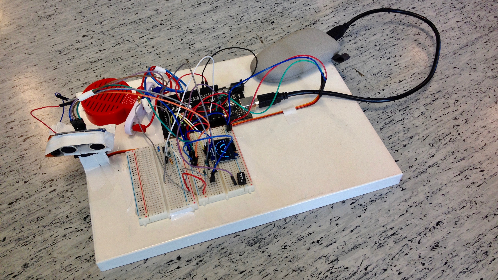

# Lasertykki

## Install

See [Platformio](http://platformio.org/get-started) or modify to run with Arduino IDE.

Add [Adafruit_SSD1306](https://github.com/adafruit/Adafruit_SSD1306) and [Adafruit GFX Library](https://github.com/adafruit/Adafruit-GFX-Library) to `./lib` directory

## Wiring

Figure out from the image below. ;)

